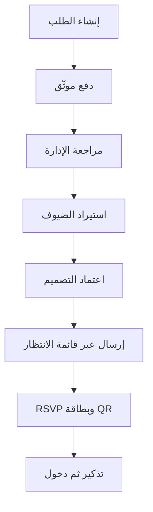

# التصور المعماري للإنتاج

## المكونات

| المكوّن | مسؤوليته |
|---|---|
| واجهة العميل | الطلب، الدفع، الاعتماد، متابعة الردود واختيار موعد التذكير |
| واجهة الإدارة | مراجعة الطلب، استيراد الضيوف، اعتماد الإرسال، مراقبة التسليم والدخول |
| API | المصادقة، الصلاحيات، قواعد العمل، الروابط ذات الاستخدام الواحد |
| PostgreSQL | الطلبات والمناسبات والضيوف والردود والمدفوعات وسجل التدقيق |
| Object Storage | نماذج العميل وملفات التصميم والبطاقات المولّدة |
| Queue/Workers | إنشاء البطاقات، الإرسال المجمع، إعادة المحاولة والتذكيرات |
| مزود الدفع | صفحة الدفع وWebhooks لحالة العملية |
| WhatsApp الرسمي | قوالب الإرسال، حالات التسليم والردود |

## تدفق الطلب

## حالات الطلب المقترحة

`draft` → `payment_pending` → `paid` → `collecting_guests` → `designing` → `awaiting_approval` → `ready_to_send` → `sending` → `active` → `completed`

أي انتقال حالة يجب أن يسجّل: المستخدم، الوقت، الحالة السابقة والجديدة، وملاحظة اختيارية.

## نموذج حماية الروابط والـQR

- خزّن `token_hash` فقط، وليس الرمز الخام.
- اجعل RSVP قابلًا للاستهلاك مرة واحدة بعملية قاعدة بيانات ذرّية.
- QR يحتوي معرّفًا عشوائيًا عالي العشوائية، لا رقم جوال ولا اسمًا.
- عند المسح، يعيد API الحد الأدنى اللازم لموظف الاستقبال.
- نفّذ قيدًا فريدًا على تسجيل الدخول لكل ضيف، مع مسار يدوي موثّق للمشرف.

## قرارات تشغيلية

- المشرف هو من يستورد الضيوف في الإصدار الأول بعد استلام الملف من العميل.
- لا يبدأ الإرسال إلا بعد الدفع، استكمال القائمة، واعتماد التصميم.
- التذكير يرسل فقط لمن أكدوا الحضور، وفق خيار 24 أو 48 أو 72 ساعة، مع موافقة المشرف النهائية.
- إعادة المحاولة تعتمد على أخطاء مزود الرسائل ولا تنشئ إرسالًا مزدوجًا؛ استخدم `idempotency_key` لكل ضيف وقالب.
